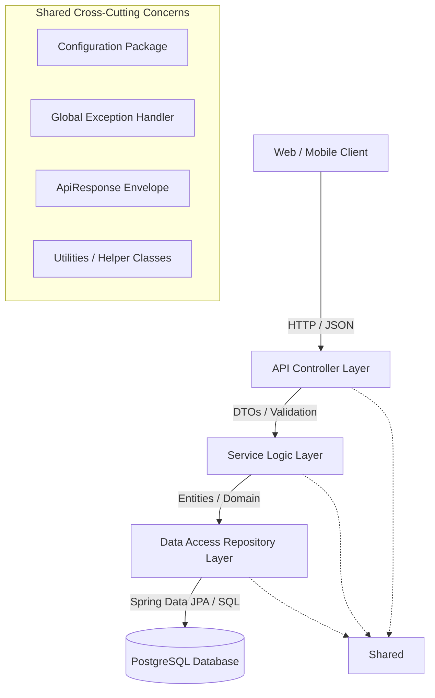

# NovaBank Backend Services - Phase 1 Foundation

Welcome to **NovaBank**, an enterprise-level Digital Banking Platform built using modern Java technologies, Spring Boot, PostgreSQL, and clean engineering principles. 

This repository contains the backend service components, initialized with **Phase 1: Project Foundation**.

---

## 1. Project Architecture
NovaBank utilizes a structured **Layered Architecture** pattern, providing clear separation of concerns (SoC), modularity, and high testability. This design isolates database models, business workflows, and web controllers.



### Architectural Tiers:
1. **API Presentation / Controller Layer (`controller`)**: Exposes RESTful endpoints, handles HTTP requests, validates request payloads, and returns consistent JSON envelopes (`ApiResponse`).
2. **Business Service Layer (`service`)**: Contains all business workflows, transaction validation, state management, and orchestration. Keep controllers thin; all logic resides here.
3. **Data Access Repository Layer (`repository`)**: Spring Data JPA repositories interfacing with the PostgreSQL database.
4. **Domain Entity Layer (`entity`)**: Database entities mapped via Hibernate annotations extending `BaseEntity`.

---

## 2. Folder and Package Structure
The application code lives under the base package `com.novabank.backend`. The package layout is organized as follows:

```
com.novabank.backend
│
├── config            # Third-party bean and framework setups (CORS, JPA Auditing, OpenAPI, BCrypt)
├── common            # Shared domain structures and global configuration objects
├── constants         # Application-wide immutable constant definitions (regex patterns, formats)
├── controller        # REST controllers exposing business APIs (to be built in Phase 2)
├── dto               # Data Transfer Objects for API request/response payloads
├── entity            # Database entity classes (persisted tables)
├── enums             # Strong typed domain enums (statuses, roles)
├── exception         # Custom domain exceptions and GlobalExceptionHandler
├── repository        # Spring Data JPA interface mapping (database queries)
├── response          # Standard wrapper envelope classes (ApiResponse)
├── security          # Authentication and Authorization infrastructure (to be built in Phase 2)
├── service           # Interfaces and business logic execution classes
├── util              # Static helper utility classes (Date, Response, and Validation utils)
└── validation        # Custom annotations and constraint validators
```

---

## 3. Coding Standards & Best Practices
To ensure enterprise-grade code maintainability, all developers must adhere to the following:

- **SOLID Principles**: Always write classes with a single responsibility. Depend on abstractions (`Interfaces`) rather than concrete service implementations.
- **Java 21 Features**: Utilize modern Java features where applicable (e.g., Records for DTOs, Pattern Matching, enhanced Stream APIs).
- **Lombok Usage**: Eliminate boilerplate using:
  - `@Data` or `@Getter/@Setter` for model classes.
  - `@Slf4j` for standardized Logging.
  - `@Builder` for constructing complex payloads safely.
- **Constructor Injection**: Never use `@Autowired` on fields. Rely on constructor injection (via `@RequiredArgsConstructor` or explicit constructor declarations) to ensure class immutability and ease unit testing.
- **Auditing**: All persistence models must extend `BaseEntity` to automatically inherit ID generation and audit timestamps (`createdAt`, `updatedAt`).

---

## 4. Naming Conventions
Follow the standard Java and Spring conventions:

| Element | Convention | Case | Example |
| :--- | :--- | :--- | :--- |
| **Packages** | Flat names, lowercase, period separated | `lowercase` | `com.novabank.backend.config` |
| **Classes / Interfaces** | Noun-based, descriptive | `PascalCase` | `ResourceNotFoundException`, `BaseEntity` |
| **Methods** | Verb-based | `camelCase` | `formatDateTime()`, `validate()` |
| **Variables / Fields** | Meaningful names | `camelCase` | `createdAt`, `phoneNumber` |
| **Enums** | Standard class names | `PascalCase` | `AccountStatus`, `RoleType` |
| **Enum Constants** | Capitalized words, snake-case | `UPPER_SNAKE` | `ACTIVE`, `ROLE_CUSTOMER` |
| **Database Tables** | Plural, snake_case | `snake_case` | `users`, `accounts`, `transactions` |
| **Database Columns** | Singular, snake_case | `snake_case` | `created_at`, `account_status` |

---

## 5. Verification and Running Local
Verify compile-time correctness and test integrity by executing:
```powershell
.\mvnw.cmd clean test
```

Start the application context locally:
```powershell
.\mvnw.cmd spring-boot:run
```
> [!NOTE]
> Database properties default to localhost parameters. Ensure your target Neon PostgreSQL instance is active or environment credentials (`SPRING_DATASOURCE_URL`, etc.) are configured.
